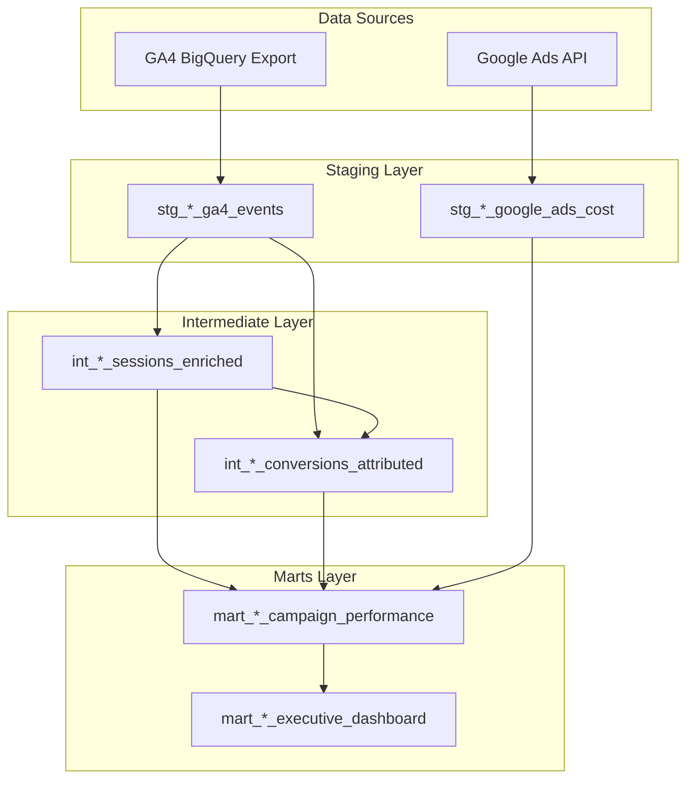

# Data Pipeline Architecture

## Overview
This document describes the data flow from raw sources through to business-ready datasets.

## Data Flow Diagram

## Client Data Scenarios

### 1. Full Integration (GA4 + Google Ads)
**Examples**: barracuda_phuket, bydlofts_phuket
- Complete user journey tracking
- GCLID-based attribution
- Full ROAS calculation with session data

### 2. GA4 Only (No Google Ads)
**Examples**: island_escape, roost_glamping
- Session and conversion tracking
- Organic and direct traffic analysis
- No cost data or ROAS metrics

### 3. Google Ads Only (No Website/GA4)
**Examples**: gofresh_fuel, gofresh_ct
- Ad performance metrics only
- Conversion tracking from Google Ads
- ROAS based on Google Ads conversions

## Key Transformations

### Staging Layer
1. **GA4 Events Flattening**
   - Unnests event parameters
   - Extracts e-commerce data
   - Preserves GCLID for attribution
   - Incremental loading by timestamp

2. **Google Ads Cost Import**
   - Campaign and ad group performance
   - Daily cost aggregations
   - Click and impression data

### Intermediate Layer
1. **Session Enrichment**
   - Groups events into sessions
   - Calculates engagement metrics
   - Applies channel grouping logic
   - Creates attribution identifiers

2. **Conversion Attribution**
   - Identifies conversion events
   - Links to originating sessions
   - Customer lifecycle classification
   - Revenue attribution

### Marts Layer
1. **Campaign Performance**
   - Unified metrics across channels
   - ROAS and CPA calculations
   - Period-over-period comparisons
   - Handles all client scenarios

2. **Executive Dashboard**
   - Pre-aggregated KPIs
   - JSON formatted for APIs
   - 30-day trends and comparisons

## Incremental Processing
- Staging tables use timestamp watermarks
- Daily incremental updates
- 90-day rolling window for analysis
- Full refresh available when needed

## Performance Optimizations
- Partitioning by date
- Clustering by key dimensions
- Incremental processing
- Pre-aggregated marts for dashboards